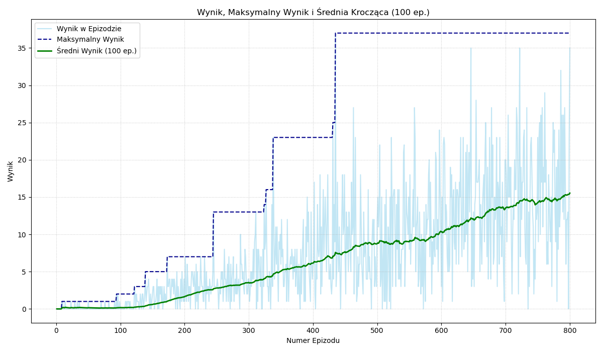

# Snake AI z Wykorzystaniem Deep Q-Network (DQN)

 

## Spis Treści
- [Wprowadzenie](#wprowadzenie)
- [Cel Projektu](#cel-projektu)
- [Technologie](#technologie)
- [Struktura Projektu](#struktura-projektu)
- [Instalacja i Uruchomienie](#instalacja-i-uruchomienie)
  - [Wymagania Wstępne](#wymagania-wstępne)
  - [Kroki Instalacji](#kroki-instalacji)
  - [Uruchamianie Treningu](#uruchamianie-treningu)
  - [Uruchamianie Ewaluacji/Wizualizacji](#uruchamianie-ewaluacjiwizualizacji)
- [Agent DQN](#agent-dqn)
  - [Architektura Sieci](#architektura-sieci)
  - [Definicja Stanu](#definicja-stanu)
  - [Przestrzeń Akcji](#przestrzeń-akcji)
  - [System Nagród](#system-nagród)
  - [Hiperparametry](#hiperparametry)
- [Wyniki Treningu](#wyniki-treningu)
- [Możliwe Ulepszenia i Dalsze Prace](#możliwe-ulepszenia-i-dalsze-prace)
- [Autor](#autor)
- [Licencja](#licencja)

## Wprowadzenie
Projekt ten prezentuje implementację klasycznej gry Snake oraz agenta opartego na sztucznej inteligencji, który uczy się grać autonomicznie. Agent wykorzystuje algorytm Deep Q-Network (DQN), popularne podejście w dziedzinie uczenia przez wzmacnianie. Środowisko gry zostało stworzone przy użyciu biblioteki Pygame, a sieć neuronowa agenta zaimplementowana w TensorFlow/Keras.

## Cel Projektu
Głównym celem projektu było:
1. Zaimplementowanie w pełni funkcjonalnej gry Snake.
2. Stworzenie agenta AI opartego na DQN, zdolnego do nauki optymalnej strategii gry.
3. Przeprowadzenie procesu treningu agenta i analiza jego postępów.
4. Wizualizacja procesu decyzyjnego agenta.

## Technologie
- **Python 3.9+**
- **Pygame:** Tworzenie środowiska gry i wizualizacja.
- **TensorFlow / Keras:** Implementacja sieci neuronowej DQN.
- **NumPy:** Operacje numeryczne.
- **Pandas & Matplotlib (opcjonalnie, dla skryptu analizy logów):** Analiza i wizualizacja danych treningowych.

## Struktura Projektu
```
.
├── old scores/                    # Katalog na zapisane modele i logi CSV
│   ├── snake_dqn_model.weights2.h5 # Przykładowy zapisany model
│   └── snake_dqn_training_log_continued_viz.csv # Przykładowy plik logu
├── snake_game_ml.py              # Główny skrypt do treningu i wizualizacji agenta DQN
├── dqn_agent.py                  # Definicja klasy agenta DQN
├── plot_training_log_separated_with_avg.py # Skrypt do generowania wykresów z logów (opcjonalny)
├── requirements.txt              # Zależności projektu
├── README.md                     # Ten plik
```

## Instalacja i Uruchomienie

### Wymagania Wstępne
- Zainstalowany Python 3.9 lub nowszy.
- (Opcjonalnie, dla treningu na GPU) Karta graficzna NVIDIA z obsługą CUDA oraz zainstalowane sterowniki CUDA i cuDNN.
- Zalecane jest użycie środowiska wirtualnego (np. `venv` lub `conda`).

### Kroki Instalacji
1. Sklonuj repozytorium:
   ```bash
   git clone https://github.com/GrabowskiB/PythonSnakeProject.git
   ```
2. (Zalecane) Utwórz i aktywuj środowisko wirtualne:
   ```bash
   # Przykład dla conda
   conda create -n snake_dqn python=3.9
   conda activate snake_dqn
   ```
   ```bash
   # Przykład dla venv
   python -m venv venv
   source venv/bin/activate  # Na Linux/macOS
   venv\Scripts\activate    # Na Windows
   ```
3. Zainstaluj zależności:
   ```bash
   pip install -r requirements.txt
   ```
   *Uwaga: Plik `requirements.txt` powinien zawierać m.in. `tensorflow`, `pygame`, `numpy`. Upewnij się, że masz wersję NumPy < 2.0 (np. 1.26.4) dla kompatybilności z TensorFlow 2.10.x.*

### Uruchamianie Treningu
Aby rozpocząć nowy trening lub kontynuować istniejący (bez szczegółowej wizualizacji każdego kroku):
1. W pliku `snake_game_ml.py` skonfiguruj:
   - `VISUALIZE_TRAINING = False`
   - `LOAD_MODEL = True` (jeśli chcesz kontynuować) lub `False` (dla nowego treningu).
   - `START_EPISODE_FROM_LOAD`, `MODEL_FILENAME`, `CSV_LOG_FILENAME` odpowiednio.
   - `target_global_episodes` w bloku `if __name__ == '__main__':` na docelową liczbę epizodów.
2. Uruchom skrypt:
   ```bash
   python snake_game_ml.py
   ```
Postępy będą logowane do pliku CSV oraz wyświetlane w konsoli. Model będzie okresowo zapisywany.

### Uruchamianie Ewaluacji/Wizualizacji
Aby uruchomić grę z nauczonym agentem i zwizualizować jego proces decyzyjny:
1. W pliku `snake_game_ml.py` skonfiguruj:
   - `VISUALIZE_TRAINING = True`
   - `LOAD_MODEL = True`
   - `MODEL_FILENAME` na ścieżkę do wytrenowanego modelu.
   - `START_EPISODE_FROM_LOAD` na numer epizodu, od którego model był trenowany (aby poprawnie ustawić epsilon, choć dla ewaluacji jest on niski).
   - `agent.epsilon = 0.01` (lub `agent.epsilon_min`) w bloku ładowania modelu, jeśli `VISUALIZE_TRAINING` jest `True`.
   - `target_global_episodes` w bloku `if __name__ == '__main__':` na niewielką liczbę (np. `START_EPISODE_FROM_LOAD + 10`), aby obejrzeć kilka rozgrywek.
   - `fps` na niższą wartość (np. 5-15) dla lepszej obserwacji.
2. Uruchom skrypt:
   ```bash
   python snake_game_ml.py
   ```
Na ekranie gry powinny być widoczne wartości Q i podejmowane przez agenta decyzje.

## Agent DQN

### Architektura Sieci
Sieć neuronowa DQN składa się z:
- Warstwy wejściowej: 11 neuronów (rozmiar wektora stanu).
- Warstwy ukrytej: 128 neuronów z funkcją aktywacji ReLU.
- Warstwy wyjściowej: 3 neurony z liniową funkcją aktywacji (odpowiadające wartościom Q dla 3 akcji).

### Definicja Stanu
Stan gry jest reprezentowany jako 11-elementowy wektor binarnych cech, opisujących:
1. Kolizję bezpośrednio przed wężem.
2. Kolizję na prawo od węża.
3. Kolizję na lewo od węża.
4. Aktualny kierunek ruchu (4 bity: lewo, prawo, góra, dół - one-hot encoding).
5. Położenie jedzenia względem głowy węża (4 bity: jedzenie na lewo/prawo/góra/dół).

### Przestrzeń Akcji
Agent może wykonać jedną z trzech akcji względem swojego aktualnego kierunku:
1. Idź prosto.
2. Skręć w lewo.
3. Skręć w prawo.

### System Nagród
- **+10 punktów:** Za zjedzenie jedzenia.
- **-100 punktów:** Za kolizję (koniec gry).
- **0 punktów:** Za każdy inny krok.

### Hiperparametry
Główne hiperparametry użyte w treningu:
- Współczynnik dyskontowania ($\gamma$): 0.95
- Początkowy $\epsilon$: 1.0
- Minimalny $\epsilon$: 0.01
- Zanik $\epsilon$: 0.995
- Współczynnik uczenia: 0.001
- Rozmiar paczki (batch size): 64
- Pojemność pamięci powtórek: 20000
- Częstotliwość aktualizacji sieci docelowej: co 5 epizodów

## Wyniki Treningu
 
*Przykład wykresu średniego wyniku na przestrzeni epizodów. Szczegółowe wykresy można wygenerować za pomocą skryptu `plot_training_log_separated_with_avg.py` na podstawie plików `.csv` z katalogu `old scores/`.*

Agent wykazał zdolność do nauki, co objawiało się wzrostem średniego wyniku i liczby kroków w epizodzie. Po 800 epizodach agent osiągał średni wynik około X (wstaw wartość ze swoich logów) i maksymalny wynik Y (wstaw wartość). Szczegółowa analiza logów treningowych znajduje się w dołączonym sprawozdaniu (jeśli dotyczy).

## Możliwe Ulepszenia i Dalsze Prace
- Eksperymenty z różnymi architekturami sieci neuronowej.
- Dopracowanie systemu nagród (np. "reward shaping").
- Implementacja bardziej zaawansowanych algorytmów RL (Double DQN, Dueling DQN, PPO).
- Zwiększenie złożoności reprezentacji stanu (np. na podstawie obrazu gry).
- Dłuższy trening na większej liczbie epizodów.

## Autor
**Bartek Grabowski]**

## Licencja
Kod udostępniony do celów edukacyjnych.

